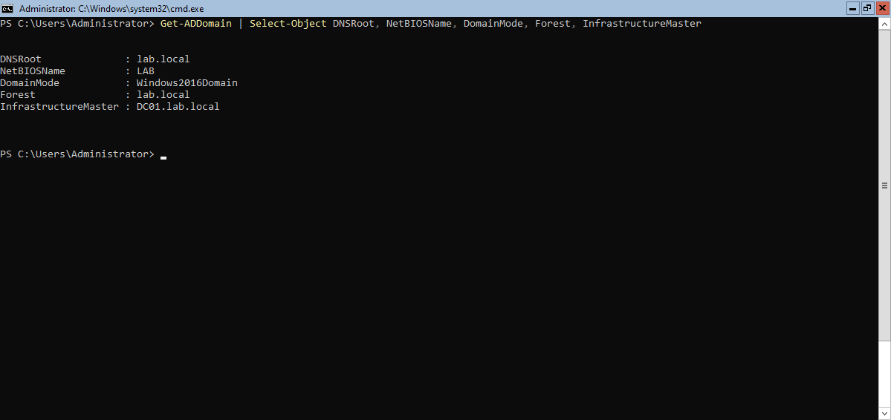
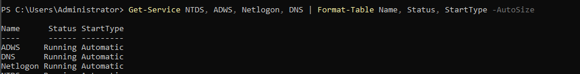
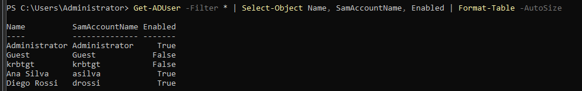
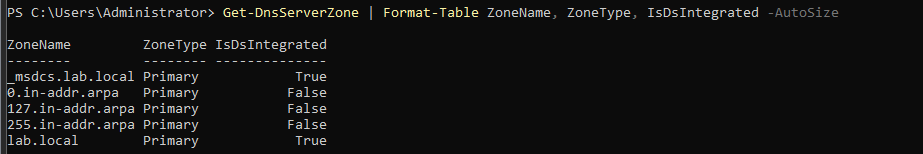
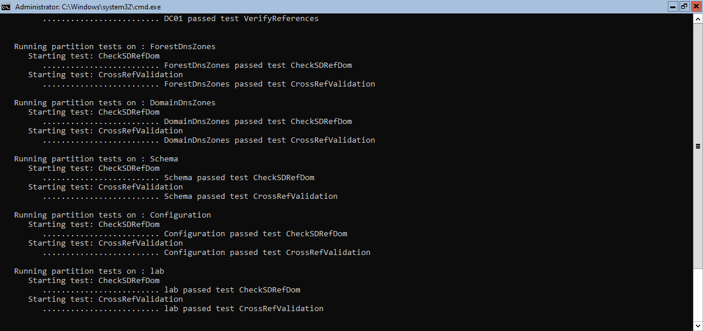

\# Stage 1 — Active Directory Domain Controller

\## Goal

Build a realistic Windows domain environment (Active Directory + DNS) to serve as the foundation for a detection lab. This stage establishes the infrastructure that later stages will monitor, attack, and defend. Active Directory is the backbone of most enterprise networks and a primary target in real-world intrusions, which makes it the right foundation for practicing detection.

\## Environment

| Component | Value |

|---|---|

| Hypervisor | VMware Workstation |

| OS | Windows Server 2022 Core |

| Hostname | DC01 |

| RAM | 4096 MB |

| Disk | 60 GB |

| Domain | lab.local |

| NetBIOS | LAB |

| Snapshots | Taken before AD DS installation and after successful promotion |

\## Network layout

| Setting | Value |

|---|---|

| IP address | 192.168.2.10/24 |

| Default gateway | 192.168.2.2 |

| DNS (during setup) | 192.168.2.2 — VMware NAT resolver |

| DNS (after promotion) | 127.0.0.1 |

| Interface index | 6 (VMware NAT adapter) |

\## Implementation

\## Verification
## Verification

Verified the domain and forest configuration — both are `lab.local`:

All four core directory services were running after promotion: NTDS, ADWS, Netlogon and DNS.

Default domain accounts were created during promotion.

The AD-integrated forward lookup zone for `lab.local` was created automatically.

`dcdiag` passed the main health checks with no critical errors.

\## Problems encountered

\## What I learned

