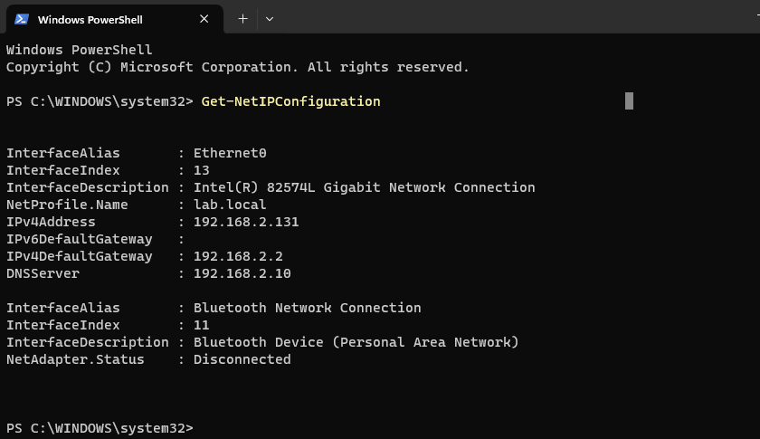
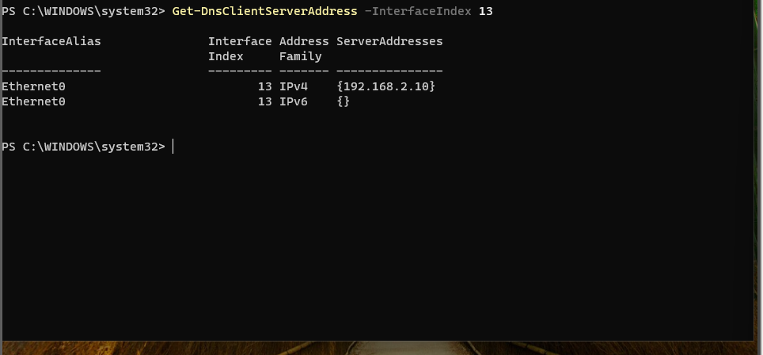
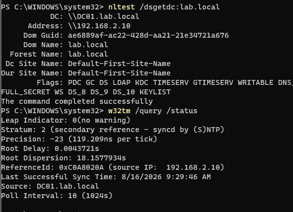
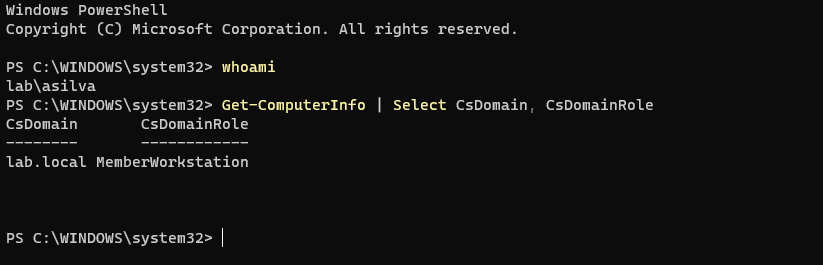
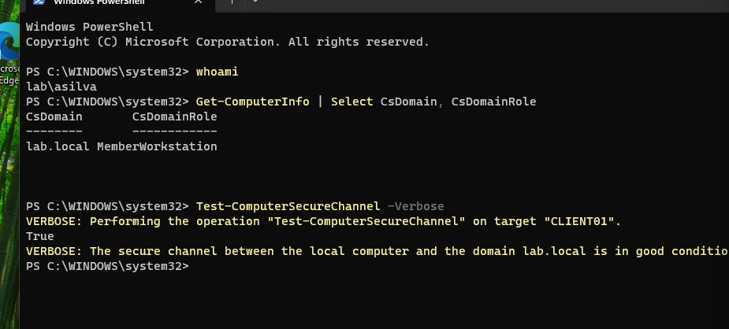
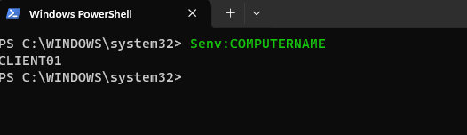

# Stage 2 — Windows 11 Client and Domain Join

## Goal

CLIENT01 is the workstation side of the lab and the main source of telemetry. Normal user activity happens here, including logons, process creation, and PowerShell usage, which can be collected and analysed later with Sysmon and the SIEM.

## Environment

| Component | Value |
|---|---|
| Hypervisor | VMware Workstation |
| OS | Windows 11 |
| Hostname | CLIENT01 |
| RAM | 4096 MB |
| Disk | 60 GB |
| Domain | lab.local |
| Computer role | MemberWorkstation |
| Domain account used | `lab\asilva` |
| Snapshots | Taken before the domain join |

## Network layout

| Setting | Value |
|---|---|
| IP address | 192.168.2.131 (DHCP) |
| Default gateway | 192.168.2.2 |
| DNS server | 192.168.2.10 (DC01) |
| Interface index | 13 |
| Adapter | Intel 82574L Gigabit (VMware NAT) |

## Implementation

Full command sequence: [scripts/02-client-join.ps1](../scripts/02-client-join.ps1)

**1. Host rename.** Renamed the machine to CLIENT01 with `Rename-Computer` before joining the domain, since renaming a domain member afterwards requires re-registering its computer object.

**2. Network check.** Confirmed with `Get-NetIPConfiguration` that CLIENT01 had received `192.168.2.131` from the VMware NAT DHCP pool and could reach the gateway.

**3. DNS configuration.** Verified the client adapter with `Get-NetAdapter` and configured its DNS server manually to `192.168.2.10`. The interface index here was 13, not 6 as on DC01 — worth confirming first, since applying the command to the wrong interface silently does nothing. The DHCP-assigned address was retained, while DNS was set explicitly to the domain controller, since the NAT gateway does not host the `lab.local` zone and cannot resolve the domain's SRV records.

**4. Domain connectivity check.** Ran `Test-NetConnection 192.168.2.10 -Port 389`, `Resolve-DnsName lab.local`, `nltest /dsgetdc:lab.local`, and `w32tm /query /status` to verify LDAP connectivity, DNS resolution, domain-controller discovery, and time synchronization.

**5. Snapshot.** Created a VMware snapshot named `CLIENT01 - pre-domain-join` before making the domain membership change, since a failed join is easier to roll back than to unwind.

**6. Domain join.** Joined CLIENT01 to the `lab.local` domain with `Add-Computer -DomainName "lab.local" -Credential (Get-Credential) -Restart`, using the `LAB\Administrator` domain account rather than the local administrator account.

**7. Post-join verification.** After the restart, verified the domain session with `whoami`, checked the domain and computer role with `Get-ComputerInfo | Select CsDomain, CsDomainRole`, tested the secure channel with `Test-ComputerSecureChannel -Verbose`, and confirmed the CLIENT01 computer object on DC01 with `Get-ADComputer -Filter * | Select Name, DNSHostName`.





## Verification

Verified that CLIENT01 received an IP address from the `192.168.2.x` subnet and can reach the domain controller.

Verified that CLIENT01 uses DC01 (`192.168.2.10`) as its DNS server.

Verified that CLIENT01 can discover the domain controller for `lab.local` and that its system time is synchronized with DC01.



Verified that the logged-in account is a domain user and CLIENT01 is registered as a member workstation in `lab.local`.



Verified that the domain secure channel between CLIENT01 and `lab.local` is healthy.



Verified the hostname after the rename.



## Problems encountered

### Forgotten domain account password

**Symptom.** Could not sign in as `asilva` after the domain join — the password had been set earlier and not recorded.

**Root cause.** No password management in place for lab accounts.

**Resolution.** Reset the password from DC01:

```powershell
Set-ADAccountPassword -Identity asilva -Reset -NewPassword (Read-Host -AsSecureString)
```

**Takeaway.** Resetting a user password is routine L1 work, and it is worth knowing the cmdlet rather than the GUI path — on Server Core there is no GUI.

## What I learned

Domain authentication depends on DNS: the client locates a domain controller through SRV records that exist only in the AD-integrated `lab.local` zone, which is why the DNS server must be DC01 and not the NAT gateway. Kerberos then adds a second requirement — tickets carry a timestamp and are rejected beyond about five minutes of clock skew, so the client's time has to match the domain controller's. The two are connected: `nltest` showed DC01 advertising both `KDC` and `TIMESERV`, and `w32tm` confirmed `Source: DC01.lab.local`, so the same server that issues tickets also supplies the time those tickets are validated against.