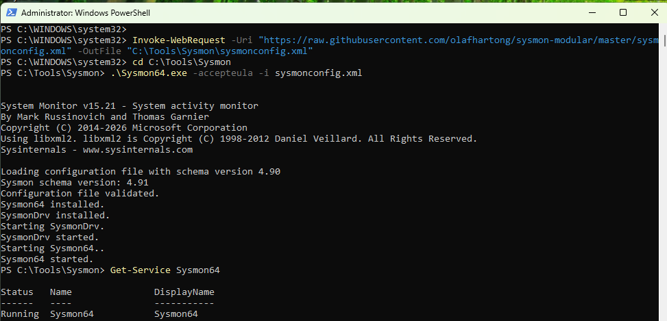
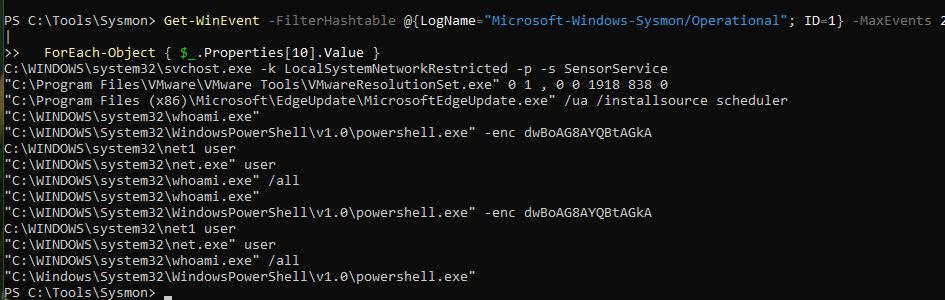
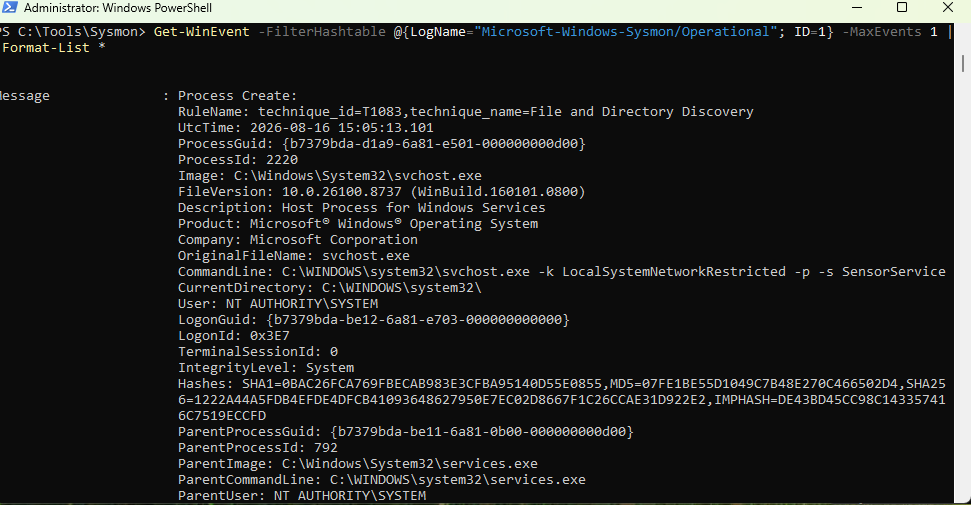
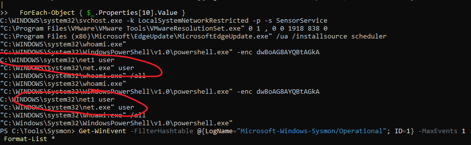
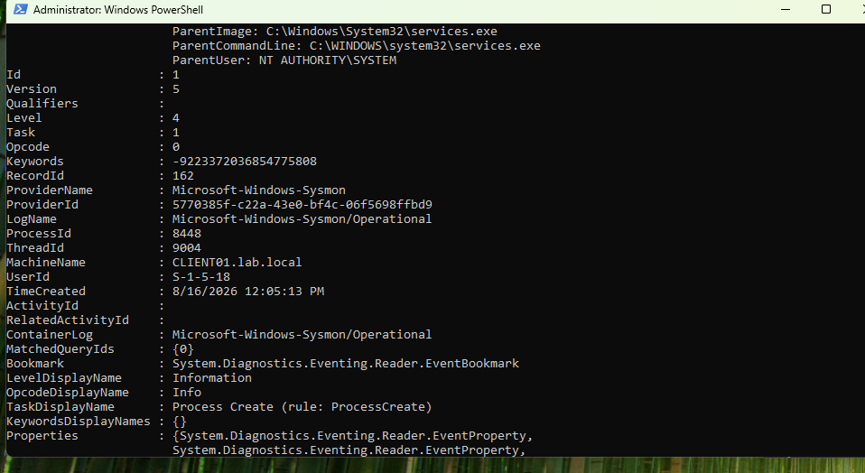

# Stage 3 — Sysmon Telemetry

## Goal

Standard Windows logs provide limited process and authentication details, making it difficult to understand what actually happened on the system. Sysmon adds detailed telemetry such as full process command lines, hashes, network connections, and parent-child process relationships, giving the SIEM more useful data for detection and investigation.

## Environment

| Component | Value |
|---|---|
| Sysmon version | 15.21 |
| Configuration | sysmon-modular (Olaf Hartong) |
| Installed on | CLIENT01, DC01 |
| Log channel | Microsoft-Windows-Sysmon/Operational |

## Implementation

Full command sequence: [scripts/03-sysmon-install.ps1](../scripts/03-sysmon-install.ps1)

**1. Download.** Downloaded Sysmon 15.21 from Microsoft Sysinternals and downloaded the sysmon-modular configuration by Olaf Hartong.

**2. Installation.** Installed Sysmon on CLIENT01 with the sysmon-modular configuration and accepted the Sysmon license with `-accepteula`.

**3. Service verification.** Confirmed the installation by checking the service state and the operational log.

**4. Telemetry generation.** Generated discovery and obfuscation telemetry with `whoami /all`, `net user`, and `powershell -enc`, then reviewed the resulting Sysmon Event ID 1 process-creation events.

**5. Deployment on DC01.** Installed Sysmon on DC01 using the same Sysmon version and configuration so that process activity and authentication-related telemetry would also be available from the domain controller.

## Verification

Verified that the `Sysmon64` service was installed and running.

Verified that Sysmon was writing events to the operational log after installation.

Verified that Event ID 1 captured the full PowerShell command line, including the encoded `-enc` argument:

`"C:\WINDOWS\System32\WindowsPowerShell\v1.0\powershell.exe" -enc dwBoAG8AYQBtAGkA`

Verified that `net user` generated process activity for both `net.exe` and `net1.exe`.

Verified the full Event ID 1 record and confirmed that it contained additional process information such as the parent process, hashes, user, and working directory.

## Detection notes

Commands run to generate telemetry, mapped to MITRE ATT&CK:

| Command | Technique |
|---|---|
| `whoami /all` | T1033 — System Owner/User Discovery |
| `net user` | T1087.001 — Account Discovery: Local Account |
| `powershell -enc` | T1027 — Obfuscated Files or Information |

Each of these commands is also run legitimately by administrators. What makes the pattern interesting is the sequence and the context — three discovery actions within seconds of each other, ending in an encoded command.

## Problems encountered

No problems were encountered during this stage. The installation and configuration worked as expected on both hosts.

## What I learned

The most useful observation was that `net user` produced two process events: `net.exe user` followed by `net1.exe user`, because `net.exe` invokes `net1.exe` internally. This showed me that a detection rule focused on only one executable could miss related activity or create duplicate alerts, so parent-child process relationships are important when interpreting Sysmon telemetry. This was not something I read about — it showed up in my own output and made me look at why.

I also learned that the parent process is one of the most valuable fields in a process-creation event. `powershell.exe` by itself is not necessarily suspicious, but PowerShell launched by an unexpected application such as `WINWORD.EXE` provides much stronger evidence of potentially malicious activity.