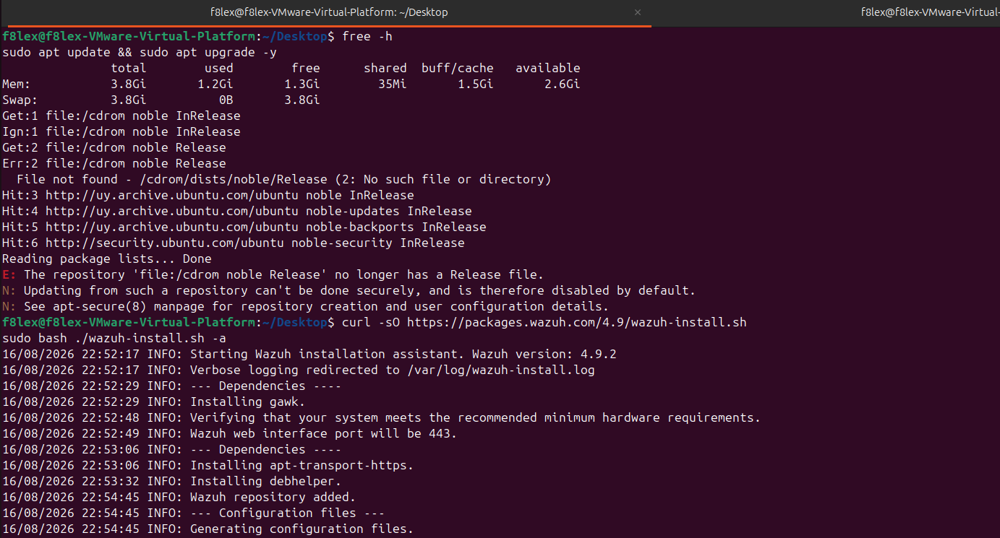
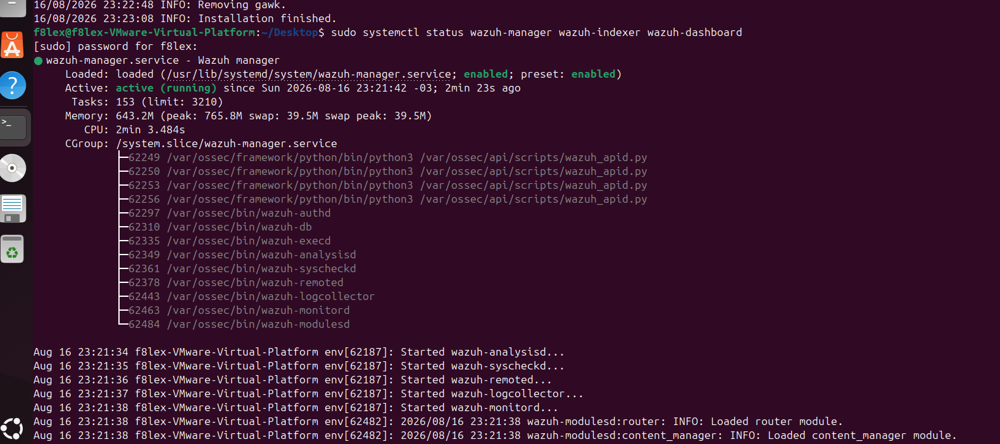
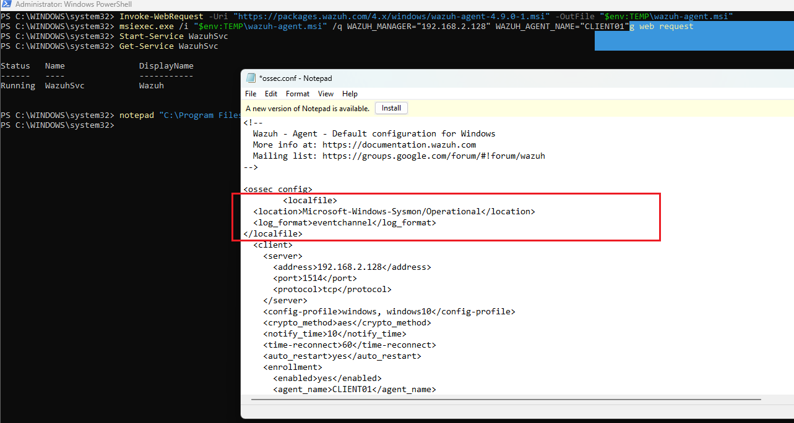
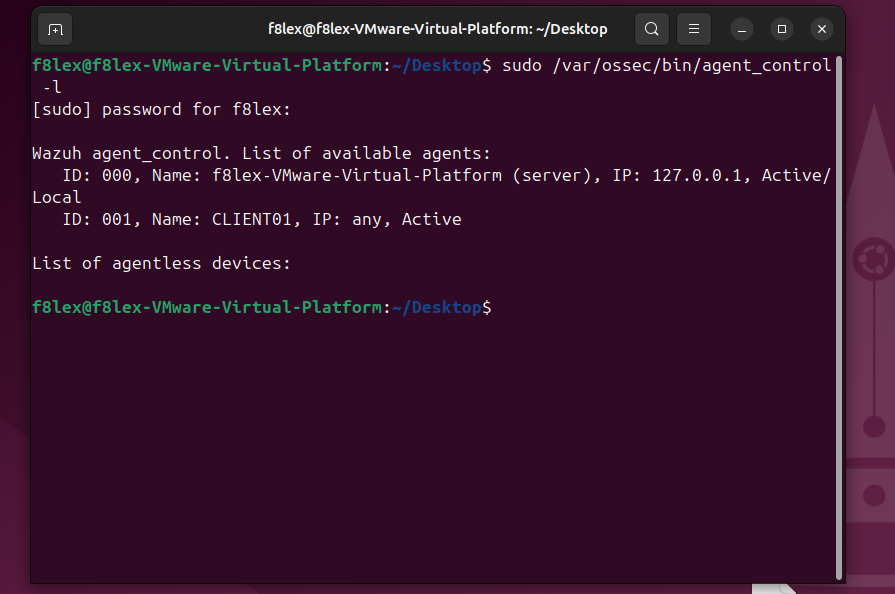
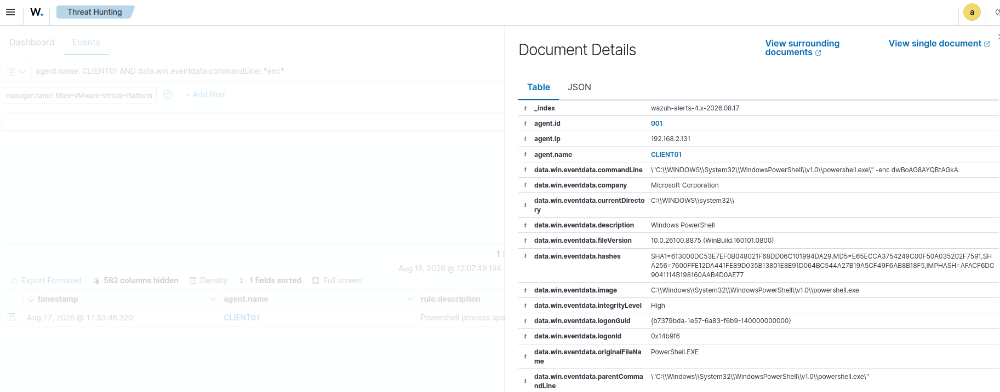

# Stage 4 — Wazuh SIEM and Agent Deployment


## Goal


Centralised collection makes correlation possible: events from different hosts mean more together than they do in isolation, and a chain of activity only becomes visible when the logs sit side by side. The SIEM also assesses each event rather than just storing it, assigning a rule and a severity level automatically. And because the logs are shipped off the host, they survive a compromise — clearing local event logs is one of the first things an attacker does.


## Environment


| Component | Value |
|---|---|
| SIEM | Wazuh 4.9.2 (all-in-one) |
| SIEM host OS | Ubuntu 24.04 LTS |
| SIEM IP | 192.168.2.128 |
| RAM | 3.8 GB |
| Agent version | 4.9.0 (Windows MSI) |
| Agents enrolled | 001 — CLIENT01 |
| Dashboard | `https://192.168.2.128` (port 443) |


## Implementation


Full command sequence: [scripts/04-wazuh-agent.ps1](../scripts/04-wazuh-agent.ps1)


**1. Server installation.** Installed Wazuh 4.9.2 on Ubuntu with the all-in-one assistant (`wazuh-install.sh -a`), which deploys the manager, indexer and dashboard on a single host.





**2. Service check.** Confirmed `wazuh-manager`, `wazuh-indexer` and `wazuh-dashboard` were all active.





**3. Dashboard access.** Reached the dashboard over HTTPS on port 443.


**4. Agent installation on CLIENT01.** Installed the Windows agent with `WAZUH_MANAGER=192.168.2.128` and `WAZUH_AGENT_NAME=CLIENT01`.


**5. Sysmon log collection.** Wazuh does not read the Sysmon channel by default. Added it explicitly in `ossec.conf` and restarted the service:


```xml

<localfile>

&#x20; <location>Microsoft-Windows-Sysmon/Operational</location>

&#x20; <log_format>eventchannel</log_format>

</localfile>

```





The agent on DC01 has not been deployed yet — that is the next step for this stage.


## Verification


Confirmed that CLIENT01 was enrolled as agent 001 and reporting as Active.





Ran the encoded PowerShell command on CLIENT01 and located the resulting alert in Threat Hunting.





## Detection notes


Hunting query used:


```

agent.name: CLIENT01 AND data.win.eventdata.commandLine: *enc*

```


Fields that carried the most weight in the resulting alert:


| Field | Value | Why it matters |
|---|---|---|
| `rule.description` | Powershell process spawned | A built-in rule fired — the event was assessed, not merely stored |
| `integrityLevel` | High | Elevated process; the same command from a standard user is a different incident |
| `hashes` | SHA1 / MD5 / SHA256 / IMPHASH | Ready-made IOCs for threat intelligence lookups |
| `parentCommandLine` | `powershell.exe` | Expected parent for a console-launched command — this is what normal looks like |
| `currentDirectory` | `C:\\WINDOWS\\system32\` | Working directory of the process |


In this test `parentCommandLine` was `powershell.exe` — PowerShell launching PowerShell, because I invoked the nested process manually from an open console. That is the baseline: nothing suspicious about it. If that field had held `WINWORD.EXE` instead, it would be a completely different story — Word has no business spawning PowerShell, and that parent-child pair is a classic indicator of an attack delivered through a malicious document macro.


## Problems encountered


### Sysmon events not reaching the SIEM


**Symptom.** The agent enrolled and reported as Active, but no Sysmon events arrived in the dashboard.


**Root cause.** Wazuh does not read the `Microsoft-Windows-Sysmon/Operational` channel by default, so nothing was being collected from it.


**Resolution.** Added the channel explicitly to `ossec.conf` and restarted the agent service.


**Takeaway.** An agent showing Active only means the connection works, not that the data you care about is being collected.


### Client lost DNS resolution


**Symptom.** CLIENT01 could not resolve domain names.


**Root cause.** The client's DNS server is `192.168.2.10` (DC01), and DC01 had been powered off to free up memory. Host connectivity had also dropped earlier after installing VMware Tools, which required restarting the NAT service.


**Resolution.** Powered DC01 back on. This was the dependency described in stage 1, encountered in practice: shutting down the domain controller breaks name resolution for every machine pointing at it.


### Memory constraints


**Symptom.** The lab could not run DC01, CLIENT01 and the Ubuntu SIEM comfortably at the same time.


**Root cause.** The Wazuh indexer alone pushes into swap, and 16 GB on the host is not enough for three VMs plus the indexer.


**Resolution.** Ran the VMs selectively depending on the task rather than all at once.


## What I learned


A single normalised event expands into nearly 600 fields — `582 columns hidden` was right there on screen. That changes what hunting actually means: it is not scrolling through logs looking for something odd, but testing a specific hypothesis by filtering on the fields that matter. At this volume there is no other way to read the data.

