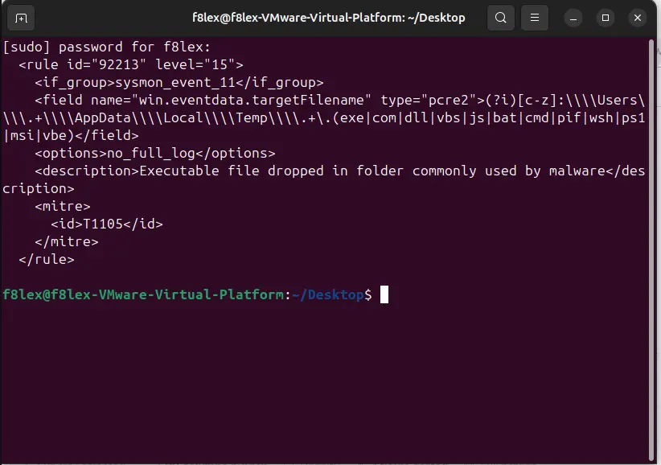
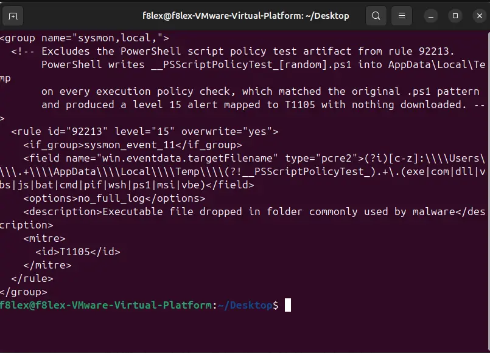
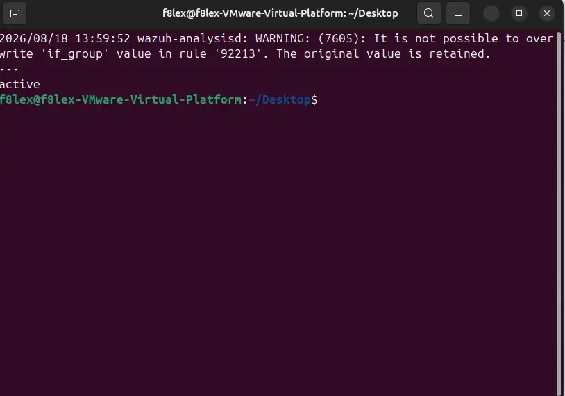
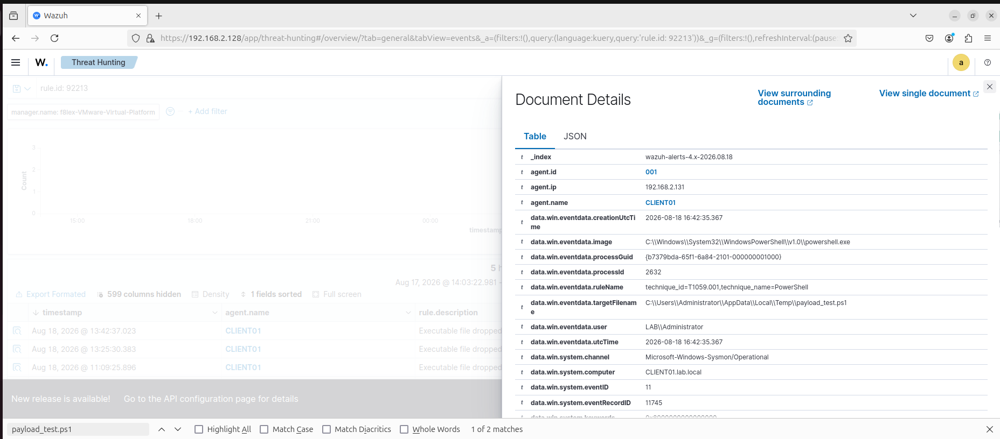

# Stage 6 — Tuning a False Positive Rule

## Goal

A false positive at level 15 is worse than a missing rule. Analysts stop trusting an alert that keeps firing on nothing, and once they start dismissing it by reflex, the one time it fires on a real intrusion gets dismissed with everything else. The fix is not to disable the rule — that removes the coverage entirely — but to narrow its condition so the known-benign case is excluded and the genuine signal survives.

## Environment

| Component | Value |
|---|---|
| SIEM | Wazuh 4.9.2 |
| Rule modified | 92213 (`sysmon_event_11`) |
| Custom rules file | `/var/ossec/etc/rules/local_rules.xml` |
| Snapshot | `Ubuntu - Wazuh + 92213 tuning` |

## The false positive

Stage 5 produced a level 15 alert on CLIENT01 mapped to T1105 (Ingress Tool Transfer). Nothing had been downloaded — the file was `__PSScriptPolicyTest_[random].spo.ps1`, which PowerShell writes into `AppData\Local\Temp` every time it checks the execution policy.

Reading the original rule showed exactly why:

The pattern matches any file in `AppData\Local\Temp` with an executable extension, and `.ps1` is on that list. The rule was not wrong in principle — a `.ps1` dropped into Temp is a reasonable thing to alert on. It simply had no exception for a known Windows artefact.

## Implementation

Rather than disabling the rule, the pattern was overridden with a negative lookahead that excludes the known artefact and leaves everything else intact:

Custom rules go in `local_rules.xml` only. Files under `/var/ossec/ruleset/` are replaced on every Wazuh upgrade, so edits there would be silently lost.

Validated the configuration before restarting the manager:

`wazuh-analysisd -t` reported that `if_group` cannot be overwritten and the original value was retained. This is expected — `if_group` is the rule's group binding, not part of the match condition, and the original value was what we wanted anyway.

## Verification

Tested in both directions, because a rule that removes the noise along with the signal is worse than the original.

| Test | Expected | Result |
|---|---|---|
| A — trigger the PowerShell policy check (`Set-ExecutionPolicy`) | no alert | no alert ✓ |
| B — write an ordinary `.ps1` into Temp | alert at level 15 | alert fired ✓ |

After the manager restart, the only event matching `rule.id: 92213` was the test payload from check B. The PowerShell artefact from check A produced nothing:

## Problems encountered

### First attempt used level 0 and did not suppress anything

**Symptom.** A child rule with `level 0` and `if_sid 92213` was added, expecting it to silence the alert. Rule 92213 kept firing at level 15.

**Root cause.** `if_sid` creates a new rule that inherits a condition — it does not cancel the parent. The parent had already generated its alert before the child was evaluated.

**Resolution.** Replaced it with `overwrite="yes"` on rule 92213 itself, narrowing the original pattern instead of trying to mask its output.

**Takeaway.** Suppressing an alert in Wazuh means changing the rule that produces it, not adding a quieter rule after it.

### Locating the original rule

**Symptom.** `grep` against the expected ruleset path returned "No such file or directory".

**Root cause.** Sysmon rules are split across per-event-ID files. Rule 92213 belongs to Event ID 11 and lives in `0830-sysmon_id_11.xml`.

**Resolution.** Found it with `find /var/ossec/ruleset -name "*sysmon*"`. The rule can also be read directly from the dashboard under Management → Rules.

## What I learned

The job is not to switch a noisy rule off or wave it away — it is to narrow the aim. A SIEM collects an enormous amount of noise by design, and that noise is exactly where an attacker hides. Every rule that gets disabled because it was annoying becomes a blind spot, and blind spots are what real intrusions live in.

That is why the check has to run in both directions. Confirming the false positive is gone proves only half of it; the other half is confirming that a genuine `.ps1` dropped into Temp still fires at level 15. A rule that removed the noise along with the signal would have looked like success and left the environment worse off.

And custom rules belong in `local_rules.xml` only. Editing files under `/var/ossec/ruleset/` would work until the next Wazuh upgrade replaced them, and the tuning would disappear silently — with nobody noticing the coverage had changed.